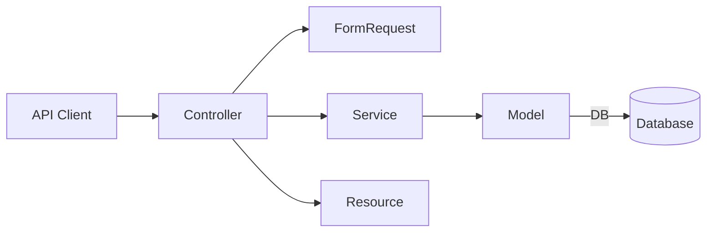
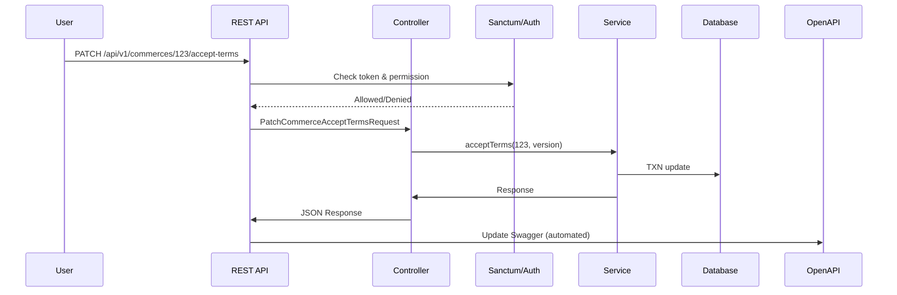

# Backend Architecture Overview

---

## Table of Contents
1. [Introduction](#introduction)
2. [Technology Stack](#technology-stack)
3. [Project Structure & Layering](#project-structure--layering)
    - [Directory Tree](#directory-tree)
    - [Layered Design](#layered-design)
4. [API Design & Conventions](#api-design--conventions)
5. [Security & Authentication](#security--authentication)
6. [Authorization & Permissions](#authorization--permissions)
7. [Business Logic & Services](#business-logic--services)
8. [Validation](#validation)
9. [API Documentation](#api-documentation)
10. [Testing](#testing)
11. [Diagrams](#diagrams)
12. [Operational Notes](#operational-notes)
13. [Contribution Standards](#contribution-standards)
14. [Resources & Further Reading](#resources--further-reading)

---

## Introduction
This document describes the backend architecture for the `sdjr` project (Laravel-based, RESTful API-first), outlining the organization, technologies, conventions, and onboarding guidance for developers.

---

## Technology Stack
- **Language**: PHP (Laravel 12.x)
- **Database**: PostgreSQL (primary), optionally supports MySQL
- **Auth**: Laravel Sanctum (SPA/API tokens)
- **Permissions**: spatie/laravel-permission
- **API Docs**: Swagger/OpenAPI via `zircote/swagger-php`
- **Testing**: PHPUnit
- **Others**: Docker (local/dev), Redis (queue/cache)

---

## Project Structure & Layering
   
### Directory Tree
<details>
<summary>Key folders (app/backend/)</summary>

```plaintext
app/backend/
├── app/
│   ├── Http/
│   │   ├── Controllers/Api/V1/
│   │   ├── Requests/Api/V1/
│   │   └── Resources/Api/V1/
│   ├── Models/
│   ├── Services/
│   └── Traits/
├── config/
├── database/
│   ├── migrations/
│   └── seeders/
├── routes/
│   └── api.php
├── tests/
│   └── Feature/Api/V1/
└── ARCHITECTURE.md
```
</details>

### Layered Design
- **Controllers**: API traffic, basic validation, auth guard/permission checks, call Services, transform response.
- **Requests**: Purpose-specific FormRequest subclasses (validation + authorization per endpoint).
- **Services**: Business logic. Orchestrate Models and lower-level services, manage DB transactions.
- **Models**: Eloquent ORM—tables/relationships, scopes, mutators, accessors. Business-meaningful model methods only.
- **Resources**: API output transformers per v1 contract.
- **Traits**: Shared helpers (eg. `ApiResponseTrait`).

---

## API Design & Conventions
- **RESTful:** HTTP verbs, plural nouns, no verbs in URIs.
- **Versioned routes:** `/api/v1/*`.
- **Success/Fail Format:** Strict standardized JSON—{success, data, error, ...}, handled by shared ApiResponseTrait.
- **OpenAPI:** All controllers annotated for Swagger docs generation.
- **Validation:** Always via FormRequest subclass; custom rules in app/Rules when needed.

---

## Security & Authentication
- **Laravel Sanctum** powers SPA and API client tokens.
- Tokens are stored hashed—never returned after creation.
- All API routes require authentication unless explicitly documented.
- Sensitive actions always require permission checks (see below).

---

## Authorization & Permissions
- Permission system: spatie/laravel-permission.
- Manage via roles (eg. provider, admin).
- Policies used for resource-level checks. Gate for simple checks.
- Example: only users with `provider.commerces.accept-terms` can PATCH `/commerces/{id}/accept-terms`.
- Seeder at `database/seeders/RolePermissionSeeder.php` for managing roles and permissions.

---

## Business Logic & Services
- All non-trivial business rules in Services (app/Services).
- Example: `CommerceService::acceptTerms()` contains transactional logic to set acceptance fields and fire hooks.
- Controllers never do DB writes or calls outside Service layer for modifiable resources.

---

## Validation
- Use FormRequests for input validation and endpoint-specific authorization.
- Request classes live in app/Http/Requests/Api/V1/.
- Custom validation rules (eg. business constraints) in app/Rules/.
- Example: `PatchCommerceAcceptTermsRequest` validates `terms_accepted_version` and user permissions.

---

## API Documentation
- All endpoints documented via `@OA` Swagger annotations in controllers.
- Run `php artisan swagger-lume:generate` to build docs.
- Docs live at `/api/documentation` (secured, only enabled on non-production by default).

---

## Testing
- **Feature Tests**: API endpoints, permissions, error flows. In `tests/Feature/Api/V1/`.
- **Unit Tests**: Services, rules, helpers. In `tests/Unit/`.
- Run tests with `php artisan test` or `vendor/bin/phpunit`.
- Migrations/seeds run in-memory during CI.

---

## Diagrams

### Overall Layered Architecture


### Commerce Accept-Terms Flow


---

## Operational Notes
- **Migrations**: Use `php artisan migrate` / `rollback`. New schema must be covered by tests.
- **Seeding**: `RolePermissionSeeder.php` updates roles/permissions as needed, run `artisan db:seed --class=RolePermissionSeeder` after permission changes.
- **Environment**: Configured via `.env`. See `.env.example` in root for all variables.
- **Error Tracking**: Standard Laravel logging, suggest integrating with Sentry in production.
- **Jobs/Events**: Long-running tasks via queues (Redis driver preferred).
- **Deployment**: Standard Laravel deploy: env config, migrate, cache clear, queue restart, reload workers.

---

## Contribution Standards
1. All new endpoints must be fully covered by feature tests, validation, and documented with OpenAPI.
2. All permission or role changes must be updated in the seeder.
3. Pull requests should reference related issues or plans in `.opencode/plans/`.
4. Significant architecture or convention changes must update this `ARCHITECTURE.md`.

---

## Resources & Further Reading
- [Laravel Docs](https://laravel.com/docs/12.x/)
- [Sanctum Docs](https://laravel.com/docs/12.x/sanctum)
- [spatie/laravel-permission](https://spatie.be/docs/laravel-permission/v6/introduction)
- [Swagger/OpenAPI for Laravel](https://zircote.github.io/swagger-php/)
- SDJR internal Onboarding Notion (ask maintainers)

---

*Maintain this file as a living document. For technical issues or to propose changes, open a PR referencing this doc and your discussion.*
