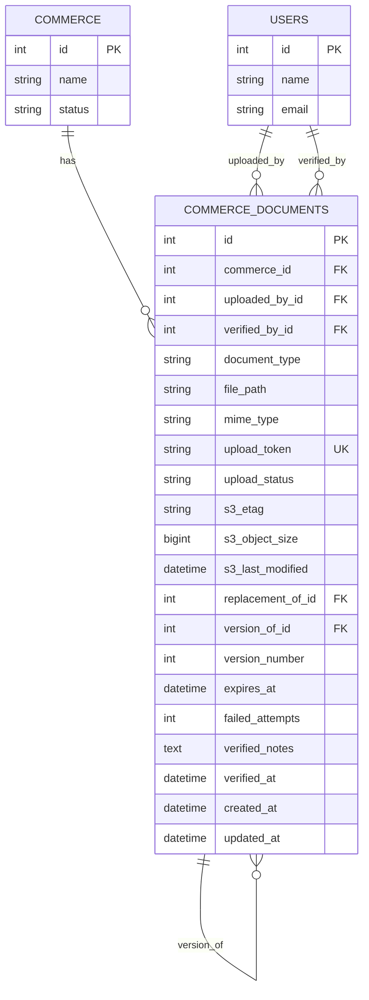

# Especificación Técnica: Sistema de Carga de Documentos con Presigned URLs

## 1. Resumen del Dominio

Sistema escalable de carga de documentos basado en **presigned URLs** (URLs pre-firmadas) que deleguen la responsabilidad de upload directamente al cliente de almacenamiento (MinIO/S3). El backend actúa como:

1. **Validador de Permisos:** Verifica que el usuario tenga derecho a subir documentos
2. **Generador de URLs:** Crea presigned URLs con expiración controlada
3. **Orquestador de Metadata:** Almacena información del documento en BD después de la carga confirmada
4. **Gestor de Ciclo de Vida:** Maneja reintentos, reemplazos, versionado y limpieza de huérfanos

---

## 2. Arquitectura y Flujo

### 2.1 Diagrama de Secuencia

```
Frontend                Backend                  MinIO/S3 Bucket
  │                       │                           │
  ├─ [1] GET /me ─────────>│ (validar permisos)       │
  │                        │                           │
  │  <─ 200 OK (user)───────┤                           │
  │                        │                           │
  ├─ [2] POST /documents/presigned ────────────────────>│
  │        {                │                           │
  │          "file_name": "...",                       │
  │          "mime_type": "...",                       │
  │          "document_type": "...",                   │
  │          "metadata": {...}                         │
  │        }               │                           │
  │                        │                           │
  │  <─ 201 CREATED────────┤                           │
  │     {                  │                           │
  │       "upload_token": "uuid",                      │
  │       "presigned_url": "https://minio/bucket/...", │
  │       "expires_in": 3600,                          │
  │       "fields": {      │                           │
  │         "key": "...",  │                           │
  │         "policy": "...",                           │
  │         "signature": "..."                         │
  │       }                │                           │
  │     }                  │                           │
  │                        │                           │
  ├─ [3] PUT presigned_url ───────────────────────────>│
  │        (file binary)   │                           │
  │                        │                           │
  │  <──────────────────────────── 200 OK ────────────┤
  │       (archivo almacenado)                        │
  │                        │                           │
  ├─ [4] POST /documents/confirm ────────────────────>│
  │        {               │                           │
  │          "upload_token": "uuid",                   │
  │          "s3_metadata": {                          │
  │            "etag": "...",                          │
  │            "object_size": 2048,                    │
  │            "last_modified": "..."                  │
  │          }             │                           │
  │        }               │                           │
  │                        │                           │
  │  <─ 200 OK─────────────┤                           │
  │     {                  │                           │
  │       "id": 1,         │                           │
  │       "document_type": "...",                      │
  │       "file_path": "s3://...",                     │
  │       "status": "confirmed"                        │
  │     }                  │                           │
  │                        │                           │
  │                        │ [5] Cleanup Job           │
  │                        │ (borra huérfanos > 24h)   │
  │                        <─────────────────────────>│
```

### 2.2 Estados del Documento

```
┌──────────┐
│ PENDING  │ (Presigned URL generada, esperando upload)
└────┬─────┘
     │
     ├─ [Success] ──> ┌──────────────┐
     │                │ CONFIRMED    │ (Upload completado, metadata guardada)
     │                └──────────────┘
     │
     └─ [Timeout/Cleanup] ──> ┌──────────┐
                              │ ORPHANED │ (Documento sin confirmar > 24h)
                              └──────────┘
```

---

## 3. Modelo de Datos

### 3.1 Cambios en Tablas Existentes

#### Tabla: `commerce_documents` (Modificación)

**Estado Actual:** Ya existe con campos básicos
**Modificación Requerida:** Agregar columnas para tracking de carga

```sql
-- Nuevas columnas a agregar:
ALTER TABLE commerce_documents ADD COLUMN (
  upload_token VARCHAR(255) UNIQUE NULLABLE DEFAULT NULL,      -- UUID para tracking de presigned URL
  upload_status ENUM('pending', 'confirmed', 'failed', 'orphaned') DEFAULT 'pending',
  s3_etag VARCHAR(255) NULLABLE,                                -- ETag de MinIO/S3 para validación
  s3_object_size BIGINT NULLABLE,                               -- Tamaño real del objeto en bucket
  s3_last_modified DATETIME NULLABLE,                           -- Timestamp de último cambio en S3
  replacement_of_id INT UNSIGNED NULLABLE,                      -- FK a documento anterior (reemplazo)
  version_of_id INT UNSIGNED NULLABLE,                          -- FK a documento original (versionado)
  version_number INT UNSIGNED DEFAULT 1,                        -- Número de versión
  expires_at DATETIME NULLABLE,                                 -- Expiración de presigned URL
  failed_attempts INT DEFAULT 0,                                -- Contador de reintentos fallidos
  created_at TIMESTAMP DEFAULT CURRENT_TIMESTAMP,
  updated_at TIMESTAMP DEFAULT CURRENT_TIMESTAMP ON UPDATE CURRENT_TIMESTAMP,
  FOREIGN KEY (replacement_of_id) REFERENCES commerce_documents(id) ON DELETE SET NULL,
  FOREIGN KEY (version_of_id) REFERENCES commerce_documents(id) ON DELETE SET NULL,
  INDEX idx_upload_token (upload_token),
  INDEX idx_upload_status (upload_status),
  INDEX idx_expires_at (expires_at)
);
```

### 3.2 Diagrama Entidad-Relación (Parcial)



---

## 4. Requerimientos Funcionales

### REQ-BE-DOC-001: Validar Permisos de Carga

**User Story Origen:**
Antes de permitir generar una presigned URL, el sistema debe validar que el usuario autenticado tenga permisos para subir documentos.

**Endpoint Sugerido:**
`GET /api/v1/me` (ya existente)

**Trigger:**
Llamada inicial del frontend para obtener datos del usuario.

**Proceso Lógico:**

1. Obtener usuario autenticado del token JWT.
2. Si no autenticado, retornar 401.
3. Verificar permiso `admin.providers.upload_documents` o equivalente según rol.
4. Retornar datos de usuario incluyendo flag `can_upload_documents: boolean`.

**Output Data (Response):**

```json
{
  "id": 1,
  "name": "Admin User",
  "email": "admin@sdjr.com",
  "role": "admin",
  "can_upload_documents": true,
  "storage_quota_mb": 5000,
  "storage_used_mb": 250
}
```

---

### REQ-BE-DOC-002: Generar Presigned URL para Upload

**User Story Origen:**
El frontend necesita una URL firmada válida para uploadar el documento directamente al bucket sin pasar el archivo por el backend.

**Endpoint Sugerido:**
`POST /api/v1/documents/presigned`

**Trigger:**
Frontend hace submit del formulario con documento seleccionado.

**Request Body:**

```json
{
  "document_type": "CAMARA_COMERCIO",
  "file_name": "chamber_cert_2026.pdf",
  "mime_type": "application/pdf",
  "file_size_bytes": 2048000,
  "commerce_id": 5,
  "metadata": {
    "custom_field_1": "valor",
    "uploaded_by_user": "user@example.com"
  }
}
```

**Proceso Lógico:**

1. Obtener usuario autenticado del JWT.
2. **Validar Permisos:**
   - Si no autenticado → retornar 401.
   - Si no tiene permiso `admin.providers.upload_documents` → retornar 403.
3. **Validar Entrada:**
   - `document_type` requerido y en enum válido → 422 si inválido.
   - `file_name` requerido, máximo 255 caracteres → 422 si excede.
   - `mime_type` en whitelist permitido (pdf, jpg, png, docx) → 422 si no.
   - `file_size_bytes` requerido, máximo 50MB → 422 si excede.
   - `commerce_id` debe existir en BD → 404 si no existe.
4. **Generar Token de Upload:**
   - Crear UUID único (`upload_token`).
   - Calcular ruta en bucket: `documents/commerce_{commerce_id}/{upload_token}/{file_name}`.
5. **Guardar Documento en BD (Estado PENDING):**
   ```sql
   INSERT INTO commerce_documents (
     commerce_id, document_type, file_path, mime_type,
     upload_token, upload_status, expires_at, uploaded_by_id,
     s3_object_size, failed_attempts
   ) VALUES (...)
   ```

   - `upload_status` = `'pending'`
   - `expires_at` = NOW() + 1 hora
   - `s3_object_size` = NULL (no cargado aún)
   - `failed_attempts` = 0
6. **Generar Presigned URL:**
   - Usar cliente MinIO/S3 SDK del backend.
   - Expiración: 1 hora.
   - Permisos: PUT (solo escritura).
7. **Retornar Presigned URL al Frontend:**
   - 201 CREATED

**Output Data (Response):**

```json
{
  "upload_token": "550e8400-e29b-41d4-a716-446655440000",
  "presigned_url": "https://minio.staging.sdjr.com:9000/documents?X-Amz-Algorithm=AWS4-HMAC-SHA256&...",
  "expires_in": 3600,
  "fields": {
    "key": "documents/commerce_5/550e8400-e29b-41d4-a716-446655440000/chamber_cert_2026.pdf",
    "policy": "eyJleHBpcmF0aW9uIjo...",
    "x-amz-signature": "..."
  },
  "s3_config": {
    "bucket": "documents",
    "endpoint": "https://minio.staging.sdjr.com:9000"
  }
}
```

**Error Codes:**

- 401: Unauthorized (sin autenticación).
- 403: Forbidden (sin permiso).
- 404: Not Found (commerce no existe).
- 422: Unprocessable Entity (validación fallida).
- 500: Internal Server Error.

---

### REQ-BE-DOC-003: Confirmar Carga Completada

**User Story Origen:**
Después de que MinIO/S3 confirma la carga del archivo, el frontend notifica al backend con metadatos del bucket para que guarde la referencia y marque el documento como confirmado.

**Endpoint Sugerido:**
`POST /api/v1/documents/confirm`

**Trigger:**
Después de upload exitoso a MinIO/S3, frontend recibe confirmación y envía metadatos al backend.

**Request Body:**

```json
{
  "upload_token": "550e8400-e29b-41d4-a716-446655440000",
  "s3_metadata": {
    "etag": "\"abc123def456\"",
    "object_size": 2048000,
    "last_modified": "2026-01-19T14:30:00Z",
    "content_type": "application/pdf"
  }
}
```

**Proceso Lógico:**

1. Obtener usuario autenticado del JWT.
2. **Validar Entrada:**
   - `upload_token` requerido → 422 si falta.
   - `s3_metadata` requerido → 422 si falta.
   - `s3_metadata.etag` requerido → 422 si falta.
3. **Buscar Documento Pendiente:**
   ```sql
   SELECT * FROM commerce_documents
   WHERE upload_token = ? AND upload_status = 'pending'
   ```

   - Si no existe → retornar 404.
   - Si `expires_at < NOW()` → retornar 410 Gone (presigned URL expirada).
4. **Validar Cambios:**
   - Comparar `s3_metadata.content_type` con `mime_type` guardado → si difiere, advertencia (no bloquea).
   - Si `s3_metadata.object_size` es 0 → retornar 400 (archivo vacío).
5. **Iniciar Transacción DB:**
6. **Actualizar Documento:**
   ```sql
   UPDATE commerce_documents SET
     upload_status = 'confirmed',
     s3_etag = ?,
     s3_object_size = ?,
     s3_last_modified = ?,
     expires_at = NULL,
     failed_attempts = 0
   WHERE upload_token = ?
   ```
7. **Si Reemplazo/Versionado (ver secciones 5.2 y 5.3):**
   - Marcar documento anterior.
8. **Commit Transacción.**
9. **Retornar Documento Confirmado:**
   - 200 OK

**Output Data (Response):**

```json
{
  "id": 42,
  "commerce_id": 5,
  "document_type": "CAMARA_COMERCIO",
  "file_path": "s3://documents/commerce_5/550e8400-e29b-41d4-a716-446655440000/chamber_cert_2026.pdf",
  "mime_type": "application/pdf",
  "upload_status": "confirmed",
  "upload_token": "550e8400-e29b-41d4-a716-446655440000",
  "s3_etag": "\"abc123def456\"",
  "s3_object_size": 2048000,
  "s3_last_modified": "2026-01-19T14:30:00Z",
  "created_at": "2026-01-19T14:25:00Z",
  "updated_at": "2026-01-19T14:30:00Z"
}
```

**Error Codes:**

- 400: Bad Request (archivo vacío).
- 404: Not Found (upload_token no existe o no está en estado pending).
- 410: Gone (presigned URL expirada).
- 422: Unprocessable Entity (validación fallida).
- 500: Internal Server Error.

---

## 5. Casos Especiales

### 5.1 Reintento (Retry)

**Escenario:** La carga inicial falla (corte de conexión, timeout, etc.). El frontend desea reintentar sin generar nuevo token.

**Flujo Alterno:**

```
Frontend                Backend                  MinIO/S3
  │                       │                           │
  ├─ [1] PUT presigned_url ───────────────────────────>│
  │        (upload fallido)                          │
  │  <─ 500 Network Error ────────────────────────────┤
  │                       │                           │
  ├─ [2] Esperan 5 segundos                          │
  │                       │                           │
  ├─ [3] PUT presigned_url (REINTENTO) ──────────────>│
  │        (mismo upload_token, mismo archivo)       │
  │  <────────────────── 200 OK ────────────────────┤
  │                       │                           │
  ├─ [4] POST /documents/confirm ────────────────────>│
  │        (mismo upload_token)                      │
  │  <─ 200 OK─────────────┤                           │
```

**Reglas:**

- El `upload_token` sigue siendo válido mientras `expires_at > NOW()`.
- Si el reintento se intenta después de expiración, retornar **410 Gone** y el frontend debe generar nuevo token.
- Cada reintento exitoso sobrescribe el archivo anterior en S3 (mismo path).
- Incrementar contador `failed_attempts` en cada intento fallido detectado por backend (si se reporta).

**Backend - Detectar Reintento Fallido (Opcional):**

Endpoint `POST /api/v1/documents/failed` para reportar fallos sin necesidad de regenerar token:

```json
{
  "upload_token": "550e8400-e29b-41d4-a716-446655440000",
  "error": "Network timeout",
  "retry_after": 5
}
```

Respuesta:

```json
{
  "upload_token": "550e8400-e29b-41d4-a716-446655440000",
  "retry_allowed": true,
  "expires_in": 3400,
  "failed_attempts": 1
}
```

---

### 5.2 Reemplazo (Replacement)

**Escenario:** El usuario sube un documento nuevo que reemplaza uno anterior. El documento viejo debe marcarse como reemplazado.

**Flujo:**

```
[1] Validar Permisos → Generamos presigned URL
[2] Frontend sube archivo nuevo
[3] Frontend confirma carga
[4] Backend:
    - Marcar documento anterior: replacement_of_id = NULL (es el nuevo)
    - Marcar documento anterior: replacement_of_id = id_anterior (marca que fue reemplazado)
    - OPCIONAL: Borrar físico de S3 del documento anterior (configuración)
```

**Modificación a REQ-BE-DOC-002:**

Agregar campo opcional al request:

```json
{
  "document_type": "CAMARA_COMERCIO",
  "file_name": "chamber_cert_2026_v2.pdf",
  "mime_type": "application/pdf",
  "file_size_bytes": 2100000,
  "commerce_id": 5,
  "replace_document_id": 40,  // <-- NUEVO
  "metadata": {}
}
```

**Validación:**

- Si `replace_document_id` se proporciona:
  - Verificar que el documento existe y pertenece al mismo commerce.
  - Verificar que no está ya reemplazado.
  - Retornar 404 si no existe o está inválido.

**Modificación a REQ-BE-DOC-003:**

En la actualización, si hubo reemplazo:

```sql
UPDATE commerce_documents SET
  upload_status = 'confirmed',
  -- ... campos normales
WHERE upload_token = ?;

-- Marcar documento anterior como reemplazado
UPDATE commerce_documents SET
  replacement_of_id = id_nuevo
WHERE id = ? AND replacement_of_id IS NULL;

-- OPCIONAL: Borrar de S3 si configuración lo permite
-- DELETE FROM s3://... el archivo anterior
```

**Respuesta de Confirmación:**

```json
{
  "id": 43,
  "document_type": "CAMARA_COMERCIO",
  "file_path": "s3://documents/commerce_5/550e8400-e29b-41d4-a716-446655440001/chamber_cert_2026_v2.pdf",
  "upload_status": "confirmed",
  "replaces_document_id": 40,
  "previous_document_status": "replaced"
}
```

---

### 5.3 Versionado (Versioning)

**Escenario:** El usuario sube versiones sucesivas del mismo documento y se quiere mantener historial completo.

**Diferencia vs Reemplazo:**

- **Reemplazo:** Solo se guarda el último (anterior se marca como reemplazado).
- **Versionado:** Se guarda todo el historial y se puede acceder a versiones anteriores.

**Flujo:**

```
[1] Primera carga (v1):
    - version_number = 1
    - version_of_id = NULL (es el original)

[2] Segunda carga (v2):
    - version_number = 2
    - version_of_id = id_v1 (pertenece a la cadena de v1)
  
[3] Tercera carga (v3):
    - version_number = 3
    - version_of_id = id_v1 (pertenece a la cadena de v1)
```

**Modificación a REQ-BE-DOC-002:**

```json
{
  "document_type": "CAMARA_COMERCIO",
  "file_name": "chamber_cert_2026_v3.pdf",
  "mime_type": "application/pdf",
  "file_size_bytes": 2200000,
  "commerce_id": 5,
  "versioning_enabled": true,  // <-- NUEVO
  "metadata": {}
}
```

**Lógica de Backend:**

```sql
-- Si versioning_enabled = true
IF versioning_enabled THEN
  -- Encontrar el documento original (version_of_id NULL para este documento_type)
  SELECT id INTO original_id FROM commerce_documents
  WHERE commerce_id = ? 
    AND document_type = ? 
    AND version_of_id IS NULL
    AND upload_status IN ('confirmed', 'replaced')
  ORDER BY created_at DESC LIMIT 1;
  
  -- Calcular número de versión siguiente
  SELECT MAX(version_number) + 1 INTO next_version FROM commerce_documents
  WHERE (id = original_id OR version_of_id = original_id);
  
  -- Insertar nuevo documento como versión
  INSERT INTO commerce_documents (...) VALUES (
    ...,
    version_of_id = original_id,
    version_number = next_version,
    ...
  );
END IF;
```

**Endpoint para Listar Versiones:**

`GET /api/v1/documents/{id}/versions`

```json
{
  "data": [
    {
      "version": 1,
      "file_path": "s3://...",
      "s3_etag": "...",
      "s3_object_size": 2048000,
      "created_at": "2026-01-15T10:00:00Z",
      "uploaded_by": "user@example.com"
    },
    {
      "version": 2,
      "file_path": "s3://...",
      "s3_etag": "...",
      "s3_object_size": 2100000,
      "created_at": "2026-01-17T11:30:00Z",
      "uploaded_by": "user@example.com"
    },
    {
      "version": 3,
      "file_path": "s3://...",
      "s3_etag": "...",
      "s3_object_size": 2200000,
      "created_at": "2026-01-19T14:30:00Z",
      "uploaded_by": "user@example.com"
    }
  ]
}
```

---

## 6. Requerimientos No Funcionales

### 6.1 Seguridad

- **Autenticación:** Todo endpoint requiere token JWT válido.
- **Autorización:** Permiso `admin.providers.upload_documents` o equivalente según rol.
- **Validación MIME Types:**
  - Whitelist: `['application/pdf', 'image/jpeg', 'image/png', 'application/vnd.openxmlformats-officedocument.wordprocessingml.document']`
  - Validar en frontend (UX) y backend (seguridad).
- **Validación Tamaño:**
  - Máximo 50 MB por archivo.
  - Máximo 5 GB por commercio (cuota configurable).
- **Path Traversal Prevention:**
  - Usar UUIDs para nombres, nunca confiar en `file_name` del usuario.
  - Path en S3: `documents/commerce_{id}/{upload_token}/{sanitized_filename}`.
- **Presigned URL Expiration:**
  - 1 hora máximo.
  - No reutilizable después de expiración.

### 6.2 Validaciones

- **Commerce Existence:** El `commerce_id` debe existir en BD.
- **Document Type Enum:** `document_type` en enum definido (CAMARA_COMERCIO, ID_CARD, RUT, etc.).
- **MIME Type Whitelist:** Solo tipos permitidos.
- **File Size:** No exceder límites por archivo y por comercio.
- **Token Uniqueness:** `upload_token` único en BD.
- **Metadata Structure:** Si se proporciona, validar estructura JSON.

### 6.3 Escalabilidad / Performance

- **Índices en BD:**
  ```sql
  CREATE INDEX idx_commerce_documents_upload_token ON commerce_documents(upload_token);
  CREATE INDEX idx_commerce_documents_upload_status ON commerce_documents(upload_status);
  CREATE INDEX idx_commerce_documents_expires_at ON commerce_documents(expires_at);
  CREATE INDEX idx_commerce_documents_commerce_id_status ON commerce_documents(commerce_id, upload_status);
  ```
- **Cleanup Job (Cron):**
  - Ejecutar cada hora.
  - Buscar documentos con `upload_status = 'pending'` y `expires_at < NOW()`.
  - Marcar como `'orphaned'`.
  - Opcionalmente, borrar del bucket después de N días (configuración).

### 6.4 Consistencia

- **Transacciones ACID:** La confirmación es una transacción única que actualiza BD + metadatos S3.
- **Idempotencia:** Si el frontend reintenta la confirmación con el mismo token, retornar 200 OK sin duplicar registros.
- **Soft Delete:** Si se borra un documento, marcar como `status = 'deleted'` en lugar de borrar.

### 6.5 Observabilidad / Logging

- **Logs:**
  - Presigned URL generada (qué usuario, qué documento).
  - Upload confirmado (metadata S3 recibida).
  - Fallos de validación (con detalles).
  - Cleanup de huérfanos (cuántos se encontraron).
- **Métricas:**
  - Documentos pendientes activos.
  - Tiempo promedio de confirmación.
  - Tasa de fallos en upload.
  - Uso de almacenamiento por comercio.

---

## 7. Stack Tecnológico

### 7.1 Backend (Laravel)

- **Storage Facade:** Laravel `Storage::disk('s3')` o `disk('minio')`.
- **MinIO SDK:** `aws/aws-sdk-php` (compatible con S3 API).
- **Config:**
  ```php
  // config/filesystems.php
  's3' => [
    'driver' => 's3',
    'key' => env('AWS_ACCESS_KEY_ID'),
    'secret' => env('AWS_SECRET_ACCESS_KEY'),
    'region' => env('AWS_DEFAULT_REGION'),
    'bucket' => env('AWS_BUCKET'),
    'url' => env('AWS_URL'),
    'endpoint' => env('AWS_ENDPOINT'),  // Para MinIO: http://minio:9000
    'use_path_style_endpoint' => env('AWS_USE_PATH_STYLE_ENDPOINT', true),
  ],
  ```
- **Presigned URL Generation:**
  ```php
  // En DocumentService o similar
  $url = Storage::disk('s3')
    ->temporaryUrl(
      $path,
      now()->addHour(),
      ['ResponseContentDisposition' => 'attachment']
    );
  ```

### 7.2 Frontend (Next.js/React)

- **File Upload Library:** `react-dropzone` o `react-fine-uploader`.
- **HTTP Client:** `axios` o `fetch` API.
- **State Management:** Zustand o Redux para tracking de upload.
- **Validación Local:**
  - MIME type check.
  - File size check.
  - Progress bar durante upload.

### 7.3 Infrastructure (Docker)

**MinIO en docker-compose.yml:**

```yaml
minio:
  image: minio/minio:latest
  environment:
    MINIO_ROOT_USER: minioadmin
    MINIO_ROOT_PASSWORD: minioadmin
  ports:
    - "9000:9000"
    - "9001:9001"
  volumes:
    - minio_data:/data
  command: minio server /data --console-address ":9001"

volumes:
  minio_data:
```

**En Staging/Producción:**

- MinIO podría reemplazarse con S3 directo (AWS).
- O usar Railway storage si está disponible.

### 7.4 Database Migrations

```php
// database/migrations/20260119_update_commerce_documents_for_upload_flow.php
Schema::table('commerce_documents', function (Blueprint $table) {
    $table->string('upload_token', 255)->unique()->nullable()->after('file_path');
    $table->enum('upload_status', ['pending', 'confirmed', 'failed', 'orphaned'])->default('pending')->after('upload_token');
    $table->string('s3_etag', 255)->nullable()->after('upload_status');
    $table->bigInteger('s3_object_size')->nullable()->after('s3_etag');
    $table->dateTime('s3_last_modified')->nullable()->after('s3_object_size');
    $table->unsignedBigInteger('replacement_of_id')->nullable()->after('s3_last_modified');
    $table->unsignedBigInteger('version_of_id')->nullable()->after('replacement_of_id');
    $table->unsignedInteger('version_number')->default(1)->after('version_of_id');
    $table->dateTime('expires_at')->nullable()->after('version_number');
    $table->unsignedInteger('failed_attempts')->default(0)->after('expires_at');
  
    $table->index('upload_token');
    $table->index('upload_status');
    $table->index('expires_at');
    $table->index(['commerce_id', 'upload_status']);
  
    $table->foreign('replacement_of_id')->references('id')->on('commerce_documents')->onDelete('setNull');
    $table->foreign('version_of_id')->references('id')->on('commerce_documents')->onDelete('setNull');
});
```

---

## 8. Plan de Implementación

### Fase 1: Setup Infraestructura (1-2 días)

1. Agregar MinIO a `docker-compose.yml`.
2. Configurar Laravel `config/filesystems.php` para MinIO.
3. Crear migración de BD.
4. Crear modelo `CommerceDocument` si no existe.

### Fase 2: Endpoints Core (3-4 días)

1. Implementar `POST /api/v1/documents/presigned` (REQ-BE-DOC-002).
2. Implementar `POST /api/v1/documents/confirm` (REQ-BE-DOC-003).
3. Tests unitarios y de integración.
4. Validaciones de seguridad.

### Fase 3: Casos Especiales (2-3 días)

1. Implementar lógica de reintento.
2. Implementar reemplazo (modificar presigned + confirm).
3. Implementar versionado (modify presigned + confirm).
4. Endpoint `GET /api/v1/documents/{id}/versions`.

### Fase 4: Mantenimiento (1-2 días)

1. Crear Cron Job para limpieza de huérfanos.
2. Agregar logging y métricas.
3. Tests de edge cases.

### Fase 5: QA y Docs (1-2 días)

1. Testing E2E frontend + backend.
2. Documentación en Swagger/OpenAPI.
3. Instrucciones de deployment.

---

## 9. Configuración de Ambiente

### 9.1 .env (Local)

```env
# MinIO / S3
AWS_ACCESS_KEY_ID=minioadmin
AWS_SECRET_ACCESS_KEY=minioadmin
AWS_DEFAULT_REGION=us-east-1
AWS_BUCKET=documents
AWS_ENDPOINT=http://minio:9000
AWS_USE_PATH_STYLE_ENDPOINT=true
AWS_URL=http://localhost:9000

# File Upload Config
FILE_UPLOAD_MAX_SIZE_MB=50
STORAGE_QUOTA_PER_COMMERCE_GB=5
DOCUMENT_UPLOAD_TOKEN_EXPIRATION_MINUTES=60
ORPHANED_CLEANUP_AFTER_HOURS=24
DELETE_OLD_FILES_AFTER_REPLACEMENT=false
```

### 9.2 .env (Staging)

```env
AWS_ACCESS_KEY_ID=<from-railway-dashboard>
AWS_SECRET_ACCESS_KEY=<from-railway-dashboard>
AWS_DEFAULT_REGION=us-east-1
AWS_BUCKET=documents-staging
AWS_ENDPOINT=<railway-s3-endpoint>
AWS_USE_PATH_STYLE_ENDPOINT=false
AWS_URL=<railway-s3-url>
```

---

## 10. Testing Strategy

### 10.1 Unit Tests

```php
// tests/Unit/Services/DocumentUploadServiceTest.php

public function test_generate_presigned_url_with_valid_input() {}
public function test_generate_presigned_url_fails_without_permission() {}
public function test_generate_presigned_url_fails_for_invalid_mime_type() {}
public function test_confirm_upload_with_valid_metadata() {}
public function test_confirm_upload_fails_with_expired_token() {}
public function test_replacement_marks_previous_document() {}
public function test_versioning_increments_version_number() {}
```

### 10.2 Integration Tests

```php
// tests/Feature/DocumentUploadTest.php

public function test_full_upload_flow_from_presigned_to_confirm() {}
public function test_retry_flow_with_same_token() {}
public function test_replacement_flow() {}
public function test_versioning_flow() {}
public function test_orphaned_cleanup_cron() {}
```

---

## 11. Resumen Técnico

| Aspecto                     | Detalle                                                   |
| --------------------------- | --------------------------------------------------------- |
| **Endpoints Nuevos**  | 4 (presigned, confirm, failed, versions)                  |
| **Cambios BD**        | 1 migración con 8 nuevas columnas + índices             |
| **Tablas Afectadas**  | `commerce_documents`                                    |
| **Modelos Afectados** | `CommerceDocument`                                      |
| **Storage Backend**   | MinIO (local) / S3 (staging/prod)                         |
| **Autenticación**    | JWT + permisos RBAC                                       |
| **Transacciones**     | Sí, para confirm + reemplazo                             |
| **Cron Jobs**         | 1 (limpieza de huérfanos)                                |
| **Seguridad**         | Presigned URLs, validación MIME, cuota de almacenamiento |
| **Performance**       | Índices en upload_token, upload_status, expires_at       |

---

## 12. Referencias y Documentos Relacionados

- [backend-endpoints-v2.md](../backend-endpoints-v2.md) - Entrada de resumen #13
- [Laravel Storage Documentation](https://laravel.com/docs/storage)
- [AWS S3 Presigned URLs](https://docs.aws.amazon.com/AmazonS3/latest/userguide/presigned-url.html)
- [MinIO Documentation](https://min.io/docs/minio/linux/developers/minio-drivers.html)

---

**Documento generado:** 2026-01-19
**Versión:** 1.0
**Estado:** Draft
