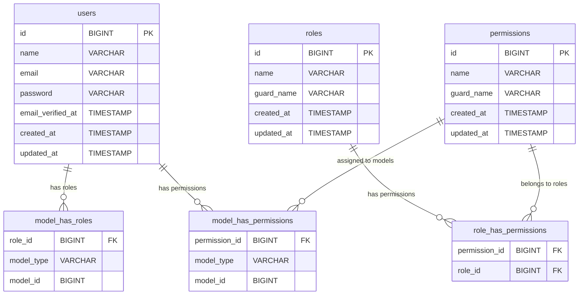

## 1. Resumen del Dominio
Este módulo aborda la resolución de tests fallando en endpoints relacionados con autenticación, roles, permisos y administradores en una aplicación Laravel utilizando Spatie Laravel Permission. Los tests fallidos indican problemas con roles inexistentes, estructuras de respuesta incorrectas y errores de autorización en operaciones de actualización de roles.

## 2. Modelo de Datos (Persistence Layer)
### 2.1 Diagrama Entidad-Relación

### 2.2 Especificación de Tablas
#### Tabla: `roles`
- **Descripción:** Almacena los roles del sistema para control de acceso basado en roles (RBAC).
- **Columnas Clave:**
  - `id` (BIGINT, PRIMARY KEY, AUTO_INCREMENT) - Identificador único del rol.
  - `name` (VARCHAR(255), UNIQUE) - Nombre del rol (ej: 'admin', 'superadmin').
  - `guard_name` (VARCHAR(255), DEFAULT 'sanctum') - Nombre del guard de autenticación.

#### Tabla: `permissions`
- **Descripción:** Almacena los permisos del sistema.
- **Columnas Clave:**
  - `id` (BIGINT, PRIMARY KEY, AUTO_INCREMENT) - Identificador único del permiso.
  - `name` (VARCHAR(255), UNIQUE) - Nombre del permiso.
  - `guard_name` (VARCHAR(255), DEFAULT 'sanctum') - Nombre del guard.

#### Tabla: `users`
- **Descripción:** Usuarios del sistema, extendidos con roles y permisos vía Spatie Laravel Permission.
- **Columnas Clave:**
  - `id` (BIGINT, PRIMARY KEY, AUTO_INCREMENT) - Identificador único del usuario.
  - `name` (VARCHAR(255)) - Nombre del usuario.
  - `email` (VARCHAR(255), UNIQUE) - Correo electrónico.
  - `password` (VARCHAR(255)) - Contraseña hasheada.

## 3. Requerimientos Funcionales (Backend Specs)

### REQ-BE-001: Crear roles faltantes en seeders
*   **User Story Origen:** Los tests fallan porque los roles 'admin' y 'superadmin' no existen en la base de datos.
*   **Endpoint Sugerido:** N/A (Seeder execution via artisan command).
*   **Trigger:** Ejecución de seeders durante setup o migraciones.
*   **Proceso Lógico (Algoritmo):**
    1.  Verificar si los roles 'admin' y 'superadmin' existen.
    2.  Si no existen, crearlos usando Spatie Role::create().
    3.  Asignar permisos relevantes a estos roles si es necesario.
*   **Output Data (Response):** N/A (Console output confirming creation).

### REQ-BE-002: Corregir estructura de respuesta en PermissionEndpoint
*   **User Story Origen:** El test falla porque la respuesta no incluye la clave 'permissions' en 'data'.
*   **Endpoint Sugerido:** `GET /api/v1/permissions`
*   **Trigger:** Llamada API para listar permisos.
*   **Proceso Lógico (Algoritmo):**
    1.  Recuperar todos los permisos de la base de datos.
    2.  Formatear la respuesta con estructura: {'data': {'permissions': [...]}, 'message': '...', 'status': true}.
*   **Output Data (Response):**
    *   Success (200): `{"data": {"permissions": [...]}, "message": "Permissions retrieved successfully", "status": true}`

### REQ-BE-003: Corregir autorización en RoleUpdateEndpoint
*   **User Story Origen:** Los tests devuelven 403 en lugar de 200 o 404, indicando problemas de permisos.
*   **Endpoint Sugerido:** `PUT /api/v1/roles/{id}`
*   **Trigger:** Llamada API para actualizar un rol.
*   **Proceso Lógico (Algoritmo):**
    1.  Verificar autenticación del usuario.
    2.  Verificar si el usuario tiene permiso para actualizar roles (ej: 'manage roles').
    3.  Buscar el rol por ID.
    4.  Si no existe, retornar 404.
    5.  Validar datos de entrada.
    6.  Actualizar el rol y sus permisos.
    7.  Retornar 200 con datos actualizados.
*   **Output Data (Response):**
    *   Success (200): `{"data": {...}, "message": "Role updated successfully", "status": true}`
    *   Error (403): `{"message": "Unauthorized", "status": false}`
    *   Error (404): `{"message": "Role not found", "status": false}`

## 4. Requerimientos No Funcionales (Quality Attributes)
*   **Seguridad:** Utilizar middleware de autenticación Sanctum y verificación de permisos para endpoints protegidos. Roles 'admin' y 'superadmin' deben tener permisos elevados.
*   **Validaciones:** Validar existencia de roles y permisos antes de asignaciones. Usar transacciones para operaciones que involucren múltiples tablas.
*   **Escalabilidad/Performance:** Crear índices en columnas de claves foráneas en tablas de permisos y roles para consultas rápidas.
*   **Consistencia:** Operaciones de creación y actualización de roles/permisos envueltas en transacciones ACID para asegurar integridad.