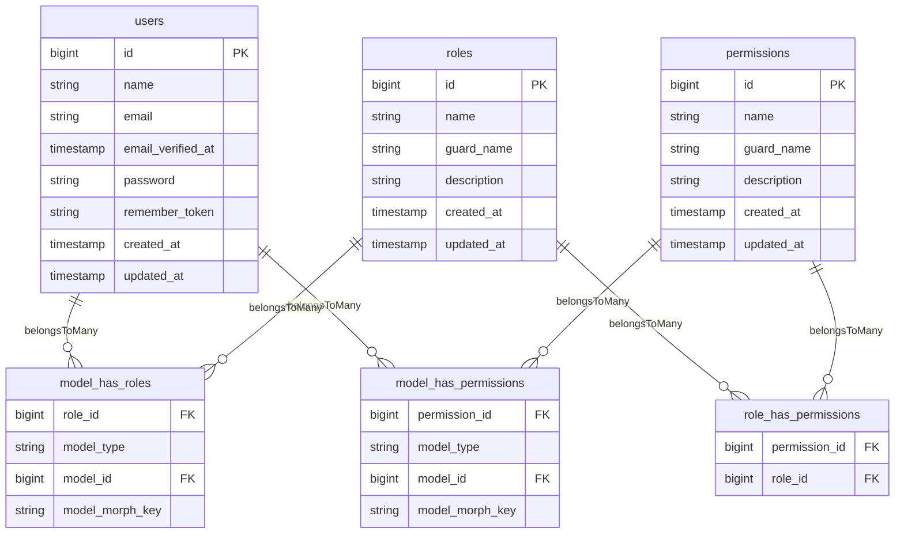

## 1. Resumen del Dominio
Refactorización del sistema de permisos para implementar una estructura jerárquica organizada por módulos (admin.* y provider.*), facilitando la gestión de autorizaciones y escalabilidad del sistema.

## 2. Modelo de Datos (Persistence Layer)

### 2.1 Diagrama Entidad-Relación

### 2.2 Especificación de Tablas

#### Tabla: `permissions`
**Descripción:** Almacena todos los permisos del sistema con estructura jerárquica
**Columnas Clave:**
- `name` (VARCHAR(255), UNIQUE con guard_name) - Nombre del permiso con estructura jerárquica (ej: admin.profiles.view)
- `guard_name` (VARCHAR(25)) - Nombre del guard (sanctum)
- `description` (VARCHAR(255), NULLABLE) - Descripción del permiso

#### Tabla: `roles`
**Descripción:** Define roles del sistema
**Columnas Clave:**
- `name` (VARCHAR(255), UNIQUE con guard_name) - Nombre del rol
- `guard_name` (VARCHAR(25)) - Nombre del guard (sanctum)
- `description` (VARCHAR(255), NULLABLE) - Descripción del rol

## 3. Requerimientos Funcionales (Backend Specs)

### REQ-BE-PERM-001: Estructura Jerárquica de Permisos
**User Story Origen:** Como administrador del sistema, necesito una estructura clara de permisos para facilitar la gestión de autorizaciones.

**Endpoint Sugerido:** N/A (Configuración del sistema)

**Trigger:** Inicialización del sistema / Migraciones

**Proceso Lógico (Algoritmo):**
1. Validar estructura de permisos jerárquicos
2. Crear permisos con prefijos admin.* y provider.*
3. Asignar permisos a roles correspondientes
4. Verificar integridad de relaciones

**Output Data (Response):** N/A

### REQ-BE-PERM-002: Limpieza de Datos de Permisos
**User Story Origen:** Como desarrollador, necesito poder resetear el sistema de permisos para testing y mantenimiento.

**Endpoint Sugerido:** N/A (Comando Artisan)

**Trigger:** Comando manual o proceso de testing

**Proceso Lógico (Algoritmo):**
1. Desasignar todos los permisos de usuarios
2. Desasignar todos los permisos de roles
3. Limpiar tablas de permisos y roles
4. Resetear auto-incrementos si es necesario

**Output Data (Response):** N/A

### REQ-BE-PERM-003: Verificación de Compatibilidad Spatie Permission
**User Story Origen:** Como arquitecto, necesito confirmar que la estructura jerárquica es compatible con Spatie Permission.

**Endpoint Sugerido:** N/A (Validación técnica)

**Trigger:** Code review / Testing

**Proceso Lógico (Algoritmo):**
1. Verificar soporte de nombres con puntos
2. Confirmar funcionamiento de wildcards
3. Validar asignación de permisos jerárquicos
4. Probar consultas con patrones

**Output Data (Response):** N/A

## 4. Requerimientos No Funcionales (Quality Attributes)

**Seguridad:**
- Todos los permisos usan guard 'sanctum' para autenticación API
- Estructura jerárquica permite granularidad fina de permisos
- Roles predefinidos: superadmin, admin, provider, user

**Validaciones:**
- Nombres de permisos deben seguir patrón: [module].[resource].[action]
- Descripciones obligatorias para todos los permisos
- Unicidad de nombre + guard_name

**Escalabilidad/Performance:**
- Índice compuesto en permissions(name, guard_name)
- Índice compuesto en roles(name, guard_name)
- Cache de permisos activado para mejor performance

**Consistencia:**
- Operaciones de permisos envueltas en transacciones
- Limpieza de cache después de modificaciones
- Verificación de integridad referencial